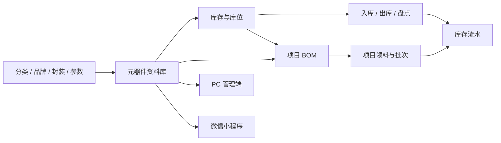
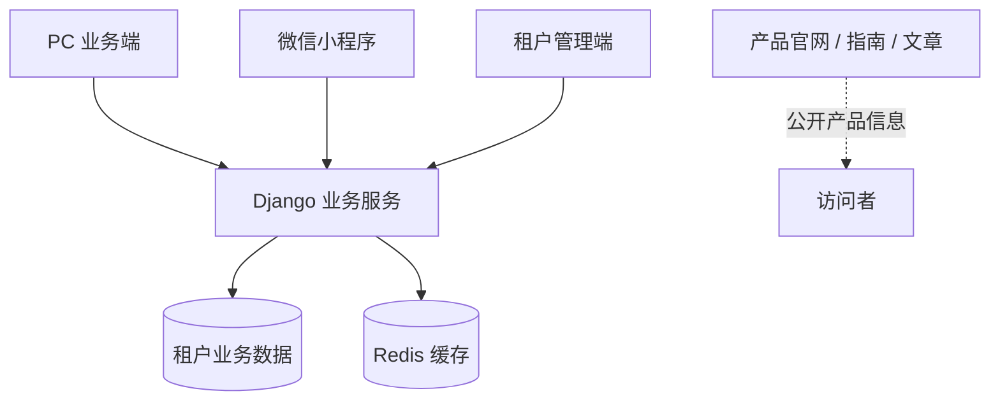

# 元器件库存管理系统

  

  <strong>让每一颗元器件，有据可查。</strong>

  面向电子研发、实验室、创客和小型硬件团队的元器件资料、库存、项目 BOM 与出入库管理系统。

  <a href="https://com.i-open.cn/">产品官网</a> ·
  <a href="https://com.i-open.cn/features">功能介绍</a> ·
  <a href="https://com.i-open.cn/docs">使用指南</a> ·
  <a href="https://com.i-open.cn/mobile">微信小程序</a> ·
  <a href="https://com.i-open.cn/contact">联系咨询</a>

---

## 一、这套系统解决什么问题

随着元器件数量增加，真正困难的往往不是“买不到”，而是无法准确回答这些日常问题：

- 这颗料以前是否买过，现在放在哪里？
- 名称相同的电阻、电容，封装、精度和功率是否一致？
- 账面库存为什么发生变化，谁在什么时候领用了多少？
- 当前库存能否满足项目 BOM，下次制作还缺哪些物料？
- 图片、数据手册、原理图和规格参数应该去哪里查？
- 多个人共同使用物料时，怎样避免重复购买、错拿和漏记？

电子表格可以记录一批数字，却很难长期维持元器件资料、实物库存、项目用量和操作记录之间的一致性。

元器件库存管理系统将这些原本分散的信息连接起来：

> **先建立统一的元器件档案，再维护真实库存；每一次数量变化生成流水，项目通过 BOM 组织物料，电脑与微信小程序使用同一份业务数据。**

它不是只显示库存数字的清单，而是一套从“建档、查料、入库、领料、项目备料到历史追溯”的持续工作方式。

## 二、适合哪些使用者

| 使用者 | 常见现状 | 系统带来的改变 |
| :--- | :--- | :--- |
| 个人创客、电子爱好者 | 元器件散落在抽屉和料盒中，依靠记忆查找 | 用名称、型号、封装、参数和库位快速定位 |
| 学校实验室、学生团队 | 多人共用物料，领用与归还缺少记录 | 共用一套资料和库存，保留操作流水 |
| 嵌入式与硬件研发团队 | 项目 BOM、库存表和数据手册分散维护 | 将项目清单关联到现有元器件资料和库存 |
| 小型生产与维修团队 | 到货、领料、退料和报废难以追溯 | 用明确的出入库动作记录每次数量变化 |
| 硬件工作室、打样团队 | 同一项目反复制作，每次重新整理物料 | 复用项目 BOM，并按批次重复执行项目出库 |

如果团队已经使用大型 ERP，并且已有成熟的采购、仓储和生产体系，本系统不应被描述为完整 ERP 的替代品。它更专注于电子元器件资料、库存和研发项目之间的协同。

## 三、核心业务全景

系统的核心不是某一个页面，而是以下业务关系始终保持一致：

1. **基础资料定义共同语言。** 分类、品牌、封装和参数用于统一描述元器件。
2. **元器件档案是业务主数据。** 图片、附件、库位、生命周期和库存都围绕同一档案组织。
3. **库存通过业务动作变化。** 入库、出库、项目领料和盘点形成可查询的记录。
4. **项目 BOM 复用元器件资料。** 清单不再是孤立表格，而是可以核对库存并执行领料的项目数据。
5. **PC 与小程序各司其职。** 电脑负责集中整理，小程序负责现场查询和轻量操作。

## 四、主要功能

### 1. 📦 元器件资料库

系统为每一种具体规格建立独立档案，集中维护：

- 名称、厂商型号和内部唯一标识；
- 分类、品牌、封装和生命周期；
- 阻值、容值、耐压、精度、功率等动态参数；
- 当前库存、库存预警值和存放位置；
- 主图、多张实物图片和相关附件；
- 数据手册、原理图、3D 文件等资料；
- 描述、创建时间和更新时间。

型号可以留空，由系统生成内部唯一标识；已有厂商型号则按实际值保存。对于名称相近的物料，列表和选择界面持续展示封装、关键参数、型号、品牌、库存与库位，减少误选。

支持按名称、型号、品牌、封装或规格参数搜索，并通过分类、品牌、封装、生命周期、库存状态、库位及动态参数组合筛选。

### 2. 🗂️ 分类与规格体系

在录入大量元器件前，可以先建立团队共用的基础资料：

- 无限级树状分类；
- 品牌名称、官网、国家地区和说明；
- 封装名称、类型、尺寸和描述；
- 参数名称、说明和显示顺序。

新增元器件、搜索和筛选均复用这套基础资料，避免“0603 / 0603封装”“TI / Texas Instruments”等多种写法长期并存。

### 3. 📊 库存查询与预警

库存页面用于查看每种元器件的：

- 当前可用数量；
- 库存预警数量；
- 正常、预警或缺货状态；
- 分类、封装、参数和库位；
- 相关历史流水。

低于预警值的物料会进入库存预警，库存为零的物料会明确显示为缺货。首页同时提供元器件种类、库存总量、预警和缺货概况，帮助使用者优先处理真正需要补充的物料。

### 4. 🔄 入库、出库与流水追溯

每一次库存变化都通过明确业务动作完成：

- 采购到货、退料或盘盈执行入库；
- 研发领料、生产领料、报废或盘亏执行出库；
- 记录数量、原因、操作时间和经办人；
- 项目领料关联项目及对应出库批次；
- 入库使用绿色、出库使用警示色，快速识别变化方向。

系统不仅回答“现在有多少”，也能回答“为什么变成了这个数量”。PC 管理端还支持库存盘点调整和库存对账，用于比较账面数量与流水理论数量。

### 5. 📋 项目与 BOM

项目管理用于围绕一个研发、打样或生产任务组织物料清单：

- 创建项目并维护名称与说明；
- 从现有元器件资料库选择物料；
- 为每项元器件填写 BOM 用量；
- 导入常见 BOM 表格并生成待确认草稿；
- 按封装、规格、厂商型号和厂家信息辅助匹配；
- 明确提示未匹配、多候选和库存不足条目；
- 按项目批量出库，生成独立批次与关联流水；
- 同一项目可以在返工、复刻或重复生产时多次出库。

BOM 导入不会直接扣减库存。使用者应先检查匹配结果、确认物料和用量，保存项目后再根据实际领料执行项目出库。

### 6. 📑 Excel 批量导入

系统保留团队熟悉的表格工作方式，但为不同业务使用不同模板：

| 导入类型 | 用途 | 结果 |
| :--- | :--- | :--- |
| 元器件资料导入 | 首次建库或批量增加元器件 | 创建资料并返回逐行处理结果 |
| 批量入库 | 为已有元器件增加库存 | 批量更新数量并生成入库流水 |
| 项目 BOM 导入 | 将现有项目清单带入系统 | 生成匹配草稿，确认后保存项目 |

元器件导入支持分类、品牌、封装和参数定义的复用与补齐，支持单元格内按行填写参数，并返回总数、成功数、失败数及逐行原因。三种模板不能互相混用。

### 7. 🖼️ 图片与附件

每个元器件可以维护多张图片并指定主图，也可以集中保存数据手册和相关文件。查看元器件时，规格、图片、附件、库存和历史记录集中在同一详情页面，不必再从多个文件夹和聊天记录中寻找资料。

### 8. 🏠 数据概览

工作台提供与日常业务直接相关的数据：

- 元器件种类和库存总量；
- 库存预警与缺货数量；
- 近期出入库变化；
- 分类、品牌、封装和生命周期分布；
- 最近操作和消息入口。

概览指标可以继续进入库存查询、预警和流水页面处理具体问题。

## 五、PC 与微信小程序协同

| 能力 | PC 管理端 | 微信小程序 |
| :--- | :---: | :---: |
| 首页与库存概览 | ✓ | ✓ |
| 元器件搜索、筛选与详情 | ✓ | ✓ |
| 新增和维护元器件 | ✓ | ✓ |
| 图片与附件 | ✓ | ✓ |
| 单品入库和出库 | ✓ | ✓ |
| 库存预警与流水 | ✓ | ✓ |
| 项目及 BOM | ✓ | ✓ |
| Excel 导入和批量入库 | ✓ | ✓ |
| 库存盘点与对账 | ✓ | — |
| 集中配置与后台运维 | ✓ | — |

PC 管理端适合大屏查看、批量整理、Excel 处理、盘点对账和项目 BOM 编辑；微信小程序适合在仓库、料架、实验台或现场完成查料、入库、出库和项目操作。

两端进入同一个工作空间时使用同一份业务数据，不是两套彼此独立的库存。

## 六、典型使用流程

### 从 Excel 建立第一批元器件资料

1. 整理团队现有的分类、品牌和封装写法。
2. 从系统下载元器件导入模板。
3. 填写名称、型号、封装、参数、库存和库位。
4. 上传表格并查看成功、失败数量和逐行说明。
5. 只修正失败条目，避免重复提交已经成功的数据。
6. 为重点物料补充主图、附件和库存预警值。

### 完成一次日常入库

1. 搜索并选择元器件。
2. 核对名称、封装、参数和库位。
3. 填写实际入库数量与原因。
4. 提交后更新库存并生成入库流水。

### 按项目 BOM 完成领料

1. 新建项目或打开已有项目。
2. 手动添加物料，或导入 BOM 表格。
3. 处理未匹配和多候选条目。
4. 核对每项用量和当前库存。
5. 执行项目出库并生成出库批次。
6. 在项目批次或库存流水中回查本次领料。

## 七、系统设计原则

### 务实的数据模型

元器件档案负责描述“是什么”，库存负责描述“还有多少”，库位负责描述“放在哪里”，流水负责解释“为什么变化”，项目 BOM 负责说明“用到哪里”。不同信息各自承担清晰职责。

### 重要操作可追溯

正常库存变化通过入库、出库、项目出库和盘点发生，并保留相关记录。项目批量出库具有重试保护，用于降低网络波动导致重复扣减的风险。

### 多工作空间隔离

系统支持不同租户使用独立工作空间。用户进入自己的域名或从小程序选择对应租户后访问业务数据，适合不同个人、团队或组织分别使用。

### 统一但不过度复杂

系统优先解决电子元器件管理中的高频问题，不强迫小型团队先建立庞大的 ERP 流程。可以从录入 20 个常用元器件开始，再逐步使用预警、项目 BOM 和盘点。

## 八、技术形态

系统由多个职责清晰的应用组成：

- **PC 业务端：** 基于 Vue 3 的完整管理界面；
- **微信小程序：** 基于 uni-app 与 TDesign UniApp 的移动端应用；
- **业务服务：** 基于 Django 与 Django REST framework；
- **租户管理端：** 用于工作空间相关运营管理；
- **产品官网：** 基于 Astro / AstroWind 的静态官网、指南和文章；
- **数据存储与缓存：** 根据部署环境使用关系型数据库与 Redis 等基础服务。

本节用于说明产品形态，不代表公开部署地址、内部接口或安全配置。

## 九、数据和使用边界

- 元器件删除需满足业务约束，不能把仍有实物库存的物料当作普通空记录删除。
- 项目可以多次出库，每次操作都会形成独立批次和流水。
- 元器件导入、批量入库和 BOM 导入使用不同模板，提交前需要核对入口。
- 网络中断后，批量业务应先查询实际数据或流水，再判断是否需要重新提交。
- BOM 自动识别用于辅助匹配，不能替代工程人员对具体规格和替代关系的判断。
- 页面中的演示截图与数据仅用于说明功能，不代表客户数量、性能或交付承诺。
- 是否提供 SaaS、私有部署及具体服务范围，以官网和正式沟通结果为准。

## 十、为什么不继续只用 Excel

| 管理问题 | 普通表格 | 元器件库存管理系统 |
| :--- | :--- | :--- |
| 规格统一 | 依靠填写习惯 | 分类、品牌、封装和参数复用 |
| 图片与手册 | 分散在本地文件夹 | 与元器件档案集中关联 |
| 库存变化 | 经常直接覆盖数字 | 入库、出库与流水记录 |
| 多人使用 | 文件版本容易冲突 | 在同一工作空间处理业务 |
| 项目清单 | BOM 与库存相互独立 | BOM 关联现有元器件及库存 |
| 现场查料 | 需要回到电脑或翻表格 | 微信小程序移动查询 |
| 历史追溯 | 很难还原变化原因 | 按物料、项目和时间查询记录 |

Excel 仍然适合数据交换和批量整理，所以系统保留导入模板；真正需要改变的是，不再把一张不断被覆盖的表格作为唯一业务依据。

## 十一、快速开始

建议从最小可用范围开始，而不是一次整理全部库存：

1. 选择 20 个最常用的元器件。
2. 统一名称、分类、封装和关键参数。
3. 为实物贴好库位并录入实际库存。
4. 从当天开始通过入库和出库记录数量变化。
5. 选择一个正在进行的项目建立 BOM。
6. 一周后抽盘并检查流水是否能够解释库存差异。

更多资料：

- [产品功能总览](https://com.i-open.cn/features)
- [元器件资料库指南](https://com.i-open.cn/docs/library)
- [库存与出入库指南](https://com.i-open.cn/docs/inventory)
- [项目与 BOM 指南](https://com.i-open.cn/docs/bom)
- [Excel 导入指南](https://com.i-open.cn/docs/import)
- [微信小程序使用指南](https://com.i-open.cn/docs/mobile)
- [如何管理好电子元器件](https://com.i-open.cn/how-to-manage-electronic-components)

## 十二、产品理念

我们相信，软件不应该只是少数企业的基础设施，而应该成为每个人都能使用的生产工具。

我们持续构建真正有用的软件与软硬件产品，也通过产品共创、能力复用与长期服务，让一个想法、一项工作、一个真实的问题，都能以更低的门槛变成属于自己的产品。

**让软件适应人的工作，而不是让人迁就软件。**

## 十三、了解、体验与联系

- 官网：[https://com.i-open.cn/](https://com.i-open.cn/)
- 使用指南：[https://com.i-open.cn/docs](https://com.i-open.cn/docs)
- 产品文章：[https://com.i-open.cn/blog](https://com.i-open.cn/blog)
- 客服与合作：[https://com.i-open.cn/contact](https://com.i-open.cn/contact)
- 联系邮箱：[offical@i-open.cn](mailto:offical@i-open.cn)

欢迎电子研发团队、实验室、创客和小型硬件团队从真实物料开始体验，也欢迎围绕使用流程、数据整理和产品能力提出反馈。

---

## 公开转载说明

本文可以作为 GitHub、Gitee 或其他公开介绍仓库的 `README.md` 使用。复制到独立仓库后，请保留产品官网和原始资料链接，并根据实际发布状态更新功能说明。

本文用于公开介绍产品，不等同于源代码许可文件，也不表示仓库中的全部代码已经开源。若公开源代码，请另行提供明确的开源许可证、安装要求、安全配置和贡献规范。

